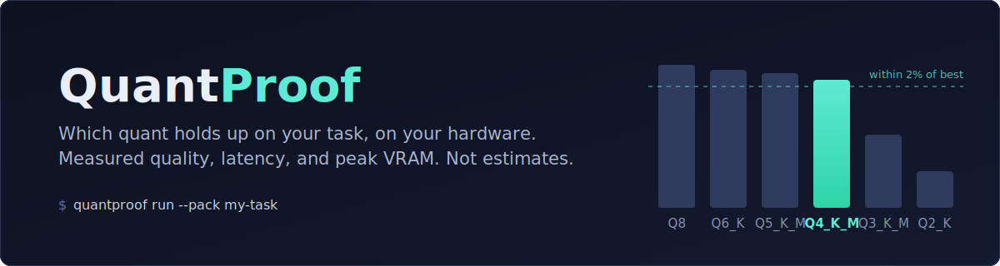

<p align="center">
  
</p>

<p align="center">
  <a href="https://www.npmjs.com/package/quantproof"></a>
</p>

<p align="center">
  <a href="#why-measure">Why measure</a> ·
  <a href="#how-it-works">How it works</a> ·
  <a href="#case-study">Case study</a> ·
  <a href="#run-it-on-your-task">Run it on your task</a> ·
  <a href="#api-runs">API runs</a> ·
  <a href="#documentation">Documentation</a>
</p>

# QuantProof

Point QuantProof at a folder of real examples from your task, and it tells
you which quantized model performs best on your hardware.

It measures, not estimates:

- **Quality**
- **Latency**
- **Peak VRAM usage**

Then it recommends the smallest quantized model whose quality is within 2%
of the best-performing model.

## Why measure

Fit calculators only tell you whether a model's weights will fit in memory.
Benchmark leaderboards rank models on general tests, not your specific
workload.

If your real question is:

> "Will Q4_K_M hurt my invoice extraction accuracy?"

there's only one reliable way to answer it: run your invoice extraction on
Q4_K_M and measure the results.

## How it works

QuantProof automates that process. It:

1. Tests candidate models one at a time
2. Scores every output deterministically
3. Measures latency and peak VRAM
4. Reports the full range of results
5. Recommends the best size/quality tradeoff

## Case study

Three task packs, two backends, one machine: an Apple M5 Max (64 GB)
running gemma3:1b (Q4_K_M) and gemma4:e4b (Q8_0) via Ollama 0.24.0,
and qwen3-coder:30b-a3b via Rapid-MLX 0.6.0. Full packs, 20 examples
x 3 repetitions per model, 540 scored generations. Every number below
is measured; the six full reports are in
[docs/case-study/](docs/case-study/).

| task pack | model | quality | pass | TTFT ms | tok/s | peak MiB |
| --- | --- | --- | ---: | ---: | ---: | ---: |
| ticket-classification | gemma4:e4b Q8_0 | **0.950** | 95% | 167 | 75 | 12335 |
| ticket-classification | qwen3-coder:30b | 0.900 | 90% | 63 | 102 | 27576 |
| ticket-classification | gemma3:1b Q4_K_M | 0.800 | 80% | 149 | 218 | 1514 |
| invoice-extraction | qwen3-coder:30b | **1.000** | 100% | 64 | 100 | 28754 |
| invoice-extraction | gemma3:1b Q4_K_M | 0.150 | 15% | 147 | 246 | 1526 |
| invoice-extraction | gemma4:e4b Q8_0 | 0.000 | 0% | 6909 | 68 | 12506 |
| config-generation | gemma4:e4b Q8_0 | **1.000** | 100% | 155 | 67 | 12434 |
| config-generation | qwen3-coder:30b | 1.000 | 100% | 66 | 100 | 29573 |
| config-generation | gemma3:1b Q4_K_M | 0.750 | 75% | 144 | 244 | 1520 |

What the data says:

- **No single model won all three tasks.** The 8B Q8 beat the 30B on
  classification at 45% of the memory, the 30B was alone at 1.000 on
  extraction, and they tied on config generation, where the 8B needs
  17 GiB less. This is why the tool runs your task instead of quoting
  a leaderboard.
- **A zero is not always a quality result.** e4b's 0.000 on extraction
  is flagged `trunc!`: 57 of 60 generations spent the whole 512-token
  budget on reasoning and never emitted content. The report names the
  fix (raise `max_tokens`) instead of letting the zero smear the model.
- **Predictions were checked against measurements.** e4b's measured
  peaks landed within 2.2% of the fit predictions on every pack;
  gemma3:1b ran 18 to 20% under its deliberately conservative ones.
- **Rapid-MLX repetitions differed byte-for-byte** on extraction
  (flagged nondeterministic) yet all 60 scored 1.000: the wording
  varied, the extracted fields did not. Deterministic scoring is what
  makes that distinction visible.

## Run it on your task

Requirements:

- Node.js 22+
- A local backend: [Ollama](https://ollama.com) (macOS, Linux,
  Windows) or [Rapid-MLX](https://github.com/raullenchai/Rapid-MLX)
  (Apple Silicon)

Quality, latency, and peak memory are measured on every machine, with
the method checked at run time and labeled in the report: NVIDIA GPUs
via nvidia-smi, Apple Silicon unified memory, and plain system RAM on
CPU-only boxes. Nothing is estimated.

```sh
npm install -g quantproof

quantproof ingest my-tasks.md   # a model drafts the pack from your notes
# or: quantproof init my-task   # scaffold it yourself

# Review the drafted examples (they are model-authored until you check them)

quantproof run --pack my-tasks
```

The sweep:

- Tests every model already downloaded in Ollama, or whatever a
  Rapid-MLX server is serving, or a specific list provided with
  `--config`
- Treats out-of-memory failures as recorded results instead of crashing

Generate a shareable report with:

```sh
quantproof report --markdown
```

To make results fully reproducible, export the raw outputs and scores:

```sh
quantproof report --bundle
```

Anyone can use the bundle to verify the scoring.

## API runs

The same task packs also run against Claude models through the Anthropic
API (`backend: anthropic` in the [run configuration](docs/run-config.md)
with `ANTHROPIC_API_KEY` set). These runs do not require Ollama or a GPU.
QuantProof still measures quality and latency, and clearly labels them as
API runs.

## Documentation

- [Task pack format](docs/task-packs.md): the part intended to be shared
- [Methodology and limitations](docs/methodology.md): read before citing results
- [Run configuration](docs/run-config.md)
